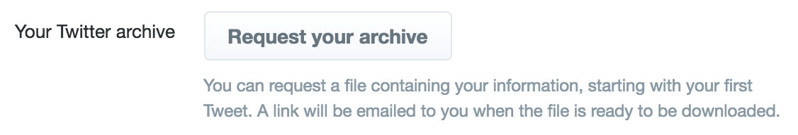

# Twitter to Ghost

Upload all your Tweets to Ghost.

# Steps

## Download

Download your Twitter archive from [the account page](https://twitter.com/settings/account) by clicking on *Request your archive*

[Mine](https://twitter.com/opyate) is [included](tweets/) as an example. (I clearly never had anything interesting to say, but hey.)

## Unzip

Unzip your archive. Call the resulting directory `tweets` or modify the code to suit.

## Make
Run `make` and it will spit out `out.json` or `out-pp.json` (the latter pretty-printed for your eyeballs, and it presumes [jq](https://stedolan.github.io/jq/). Come on - tell me you have jq installed...).

## Import

Go to Ghost Labs admin menu, and import `out.json`

# Caveats

I've hard-coded two tags, but you should modify this. Please send me a PR to make this bit of the tool configurable.
